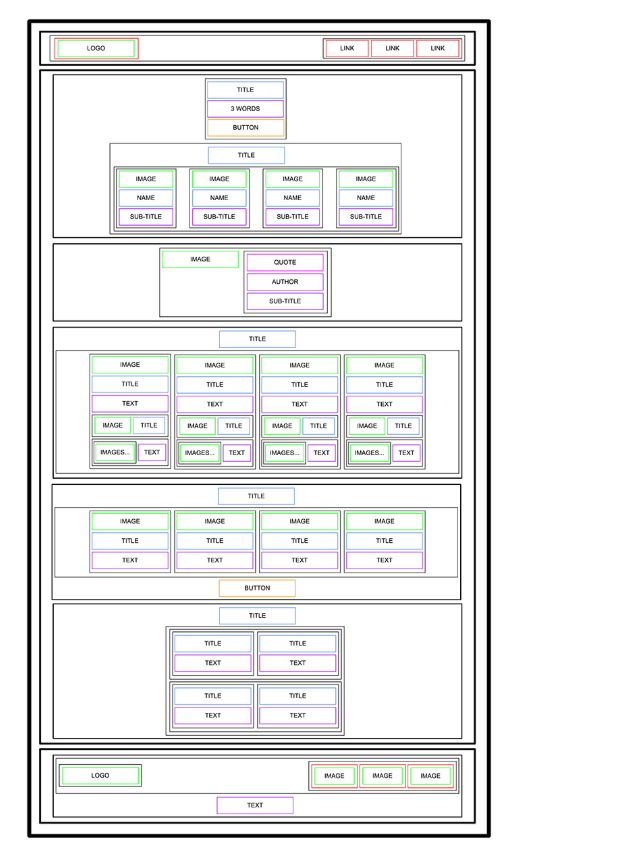

# alu-web-development

HTML/CSS/JavaScript projects — no external libraries or frameworks.

## Projects

- [html_basic](./html_basic/README.md) — Building a personal website from
  scratch: valid HTML structure, headings, images, embedded tweets, and a
  consistent header/main/footer layout across pages.
# CSS, advanced

Styling the "SmileSchool" landing page built in HTML, advanced. This
project takes the semantic HTML structure and applies the full visual
design from the Figma file — colors, spacing, typography, Flexbox/Grid
layouts, and imagery — section by section: header, banner, quote,
videos list, membership, FAQ, and footer.

## Files

| File | Description |
| --- | --- |
| `index.html` | Copied from html_advanced, unchanged structure |
| `styles.css` | All visual styling for the page |
